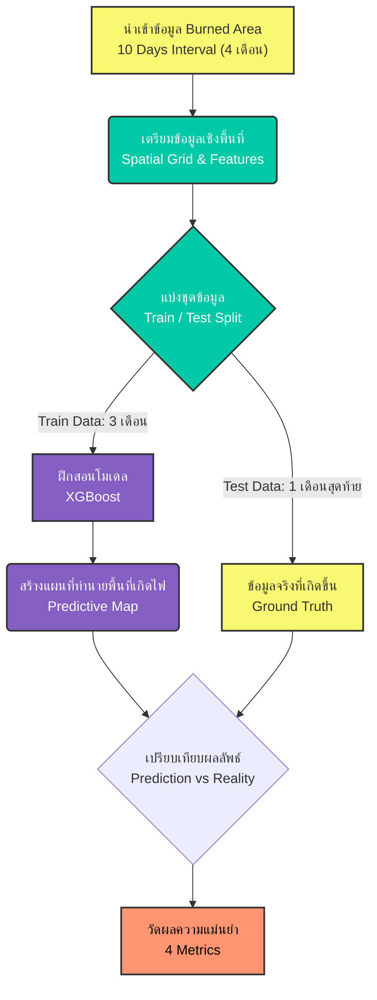
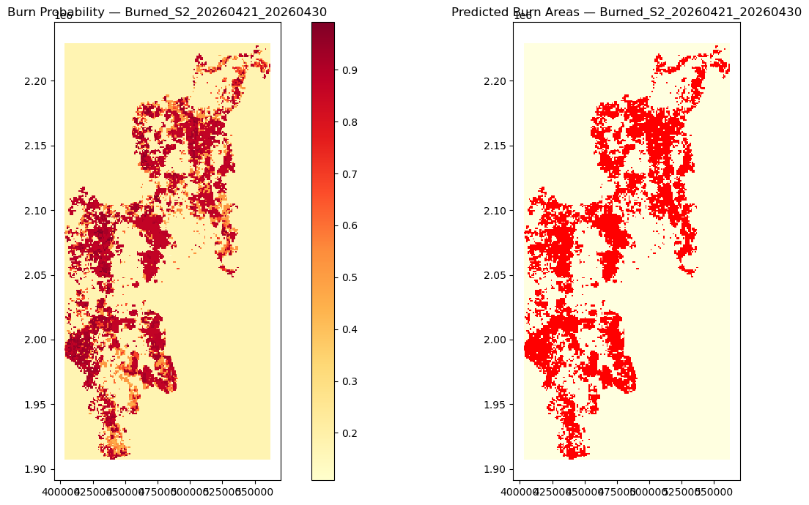

# 🔥 GeoAI Classification Model in Chiang Mai: การคาดการณ์พื้นที่เผาใหม่ของพื้นที่เชียงใหม่ด้วย XGBoost

## 📖 ภาพรวมของโปรเจกต์ (Project Overview)
โปรเจกต์นี้คือการสร้าง **GeoAI Classification Model** เพื่อคาดการณ์ว่า พื้นที่บริเวณนั้นจะเกิดการเผาไหม้ซ้ำหรือไม่ โดยวิเคราะห์จากข้อมูลในอดีต ซึ่งข้อมูลถูกเก็บในทุกๆ 10 วันของแต่ละเดือน ตั้งแต่วันที่ 1 มกราคม 2026 - 30 เมษายน 2026 เป็นเวลา 4 เดือน

วัตถุประสงค์ของโปรเจคนี้ :
> *"ในอีก 10 วันถัดไป พื้นที่กริดไหนมีโอกาสเกิดไฟป่าขึ้นอีก?"*

---

## ⚙️ สถาปัตยกรรมและการทำงาน (Workflow & Methodology)

Model : XGBClassifier สถาปัตยกรรมของโมเดลนี้คือการนำ ต้นไม้ตัดสินใจ (Decision Trees) ขนาดเล็กจำนวนหลายๆ ต้นมาต่อเรียงกันเป็นอนุกรม (Sequential) โดยต้นไม้ต้นถัดไปจะถูกสร้างขึ้นมาเพื่อเรียนรู้และแก้ไข "ค่าความผิดพลาด" (Residuals) ของต้นไม้ต้นก่อนหน้า

ที่มีประสิทธิภาพสูงในการดึงแพทเทิร์นที่ซับซ้อนจากข้อมูลเชิงพื้นที่ โดยสามารถดูขั้นตอนการทำงานได้จาก Flowchart ด้านล่างนี้:

## 📊 การทดสอบและการวัดผล (Evaluation Metrics)

เราทำการประเมินประสิทธิภาพของโมเดลโดยเทียบผลลัพธ์การทำนาย (Prediction) กับข้อมูลที่เกิดขึ้นจริง (Ground Truth) ด้วยตัวชี้วัดที่เหมาะสมกับข้อมูลเชิงพื้นที่ ดังนี้:

| ตัวชี้วัด (Metric) | สูตรการคำนวณ (Formula) | ความหมายและสิ่งที่ใช้วัด (Description) |
| :--- | :--- | :--- |
| **F1-Score** | `2 × P × R / (P + R)` | วัดความสมดุลระหว่าง Precision และ Recall (โมเดลต้องไม่ทายหว่านแห และไม่พลาดจุดสำคัญ) |
| **IoU** | `TP / (TP + FP + FN)` | วัดพื้นที่ทับซ้อนจริง (Spatial Overlap) ว่าขอบเขตที่ AI ทำนายตรงกับที่ไหม้จริงแค่ไหน |
| **AUC-ROC** | *Area Under Curve* | วัดเกรดภาพรวมของโมเดล ความสามารถในการแยกแยะ Class 0/1 ในทุกระดับ Threshold |
| **Spatial Accuracy** | `Grid ทายถูก / Grid จริงทั้งหมด` | เน้น Recall เฉพาะจุดที่ไหม้จริง วัดว่าโมเดลสามารถ "ชี้เป้า" ถูกต้องได้กี่เปอร์เซ็นต์ |

> *หมายเหตุ: `P = Precision`, `R = Recall`, `TP = True Positive`, `FP = False Positive`, `FN = False Negative`*

## 📈 ผลการประเมินประสิทธิภาพโมเดล (Model Evaluation Results)

### 🗺️ แผนที่คาดการณ์พื้นที่เสี่ยงไฟป่า (Prediction Maps)
*(ภาพเปรียบเทียบระหว่างความน่าจะเป็นในการเกิดไฟป่า และพื้นที่ที่โมเดลตัดสินใจทำนาย)*

### ตารางรายงานผลความแม่นยำ (Classification Report)
โมเดลสามารถดักจับพื้นที่ไหม้จริง (Recall สำหรับ Class 1) ได้สูงถึง **82%** ซึ่งตอบโจทย์การเฝ้าระวังภัยพิบัติที่ต้องการลดอัตราการพลาดจุดสำคัญให้เหลือน้อยที่สุด

| กลุ่มข้อมูล (Class) | Precision | Recall | F1-Score | Support |
| :--- | :---: | :---: | :---: | :---: |
| **ไม่ไหม้ (0)** | 0.98 | 0.85 | 0.91 | 9,226 |
| **ไหม้ (1)** | 0.37 | 0.82 | 0.51 | 1,014 |
| **Accuracy** | | | 0.84 | 10,240 |
| **Macro Avg** | 0.67 | 0.83 | 0.71 | 10,240 |
| **Weighted Avg** | 0.92 | 0.84 | 0.87 | 10,240 |
